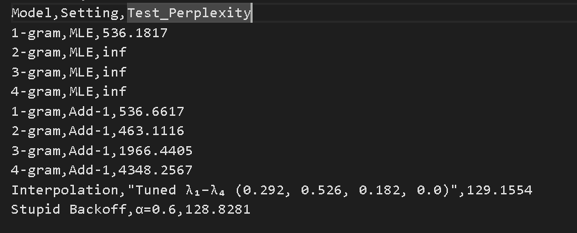

## 🧠 N-Gram Language Modeling and Evaluation

---------------------------

Author:
    Prakhar P. Tiwari | 121323248  
## 📘 Overview
This project implements and evaluates **N-gram language models** on the Penn Treebank (PTB) dataset.  
It explores the effects of model order, smoothing, and backoff/interpolation strategies on **perplexity** and **text generation**.

The assignment demonstrates:
- Understanding of the **Markov assumption**
- Handling **data sparsity** via smoothing and interpolation
- Evaluating language models using **perplexity**
- Generating realistic text sequences from trained models

---

## 🧩 Features
✅ Supports **1-gram to 4-gram** language models  
✅ Implements:
- **Maximum Likelihood Estimation (MLE)**
- **Add-1 (Laplace) Smoothing**
- **Linear Interpolation** (λ₁–λ₄)
- **Stupid Backoff** (α tuning)  
✅ Automated **tuning** using random search with multithreading  
✅ **Checkpointing** — skips retraining if models exist  
✅ **CSV Logging** for perplexity results (`results/summary.csv`)  
✅ **Text Generation** for both Interpolation and Backoff models  
✅ Modular, reusable structure for experimentation

---

## 🏗️ Project Structure

    Ngram_Language_Model/
    │
    ├── data/
    │ ├── ptb.train.txt
    │ ├── ptb.valid.txt
    │ └── ptb.test.txt
    │
    ├── src/
    │ ├── preprocess.py
    │ ├── ngram_model.py
    │ ├── smoothing.py
    │ ├── evaluate.py
    │ ├── fine_tuning.py
    │ └── generate.py
    │
    ├── models/
    │ ├── uni.pkl
    │ ├── bi.pkl
    │ ├── tri.pkl
    │ ├── tetra.pkl
    │ ├── interp_best.pkl
    │ └── backoff_best.pkl
    │
    ├── results/
    │ ├── summary.csv
    │ ├── generated_interpolation.txt
    │ └── generated_stupid_backoff.txt
    │
    ├── main.py
    ├── requirements.txt
    ├── Final_report.pdf
    └── README.md


---

## ⚙️ Setup Instructions

### 1️⃣ Environment
```bash
conda create -n ngram_env python=3.10
conda activate ngram_env
pip install -r requirements.txt
```
🚀 How to Run
▶️ Training + Evaluation + Text Generation
python main.py

What Happens:

Loads PTB dataset and builds vocabulary
Trains N-gram models (1–4) if not already saved

Evaluates:

    1. MLE (unsmoothed)

    2. Add-1 smoothing

    3. Fine-tunes:

        Interpolation λ₁–λ₄ (randomized + multithreading)

        Stupid Backoff α (parallel tuning)

    4. Logs all perplexities to results/summary.csv

    5. Generates 15 sentences from each model and saves them to:

        results/generated_interpolation.txt

        results/generated_stupid_backoff.txt

📊 Example Console Output
[INFO] Base models found — loading instead of retraining.
[LOADED] uni.pkl ... tetra.pkl
[INFO] Evaluating unsmoothed models...
1-gram MLE perplexity: 948.22
2-gram MLE perplexity: 394.15
3-gram MLE perplexity: 244.17
4-gram MLE perplexity: 196.08

[INFO] Evaluating Add-1 (Laplace) smoothing...
...

[INFO] Tuning λ₁–λ₄ using validation set...
Final Test Perplexity (Interpolation): 118.54
Final Test Perplexity (Stupid Backoff): 115.27
✅ All evaluations and text generation complete.

🧾 Output Files

    File	Description
    
    results/summary.csv ===>	Logs all model perplexities
    
    models/*.pkl ===>	Saved N-gram, Interpolation, and Backoff models
    
    results/generated_interpolation.txt	===> 15 sentences from interpolation model
    
    results/generated_stupid_backoff.txt ===> 15 sentences from backoff model


🧠 Report Integration (Assignment Section 4)

 Final Result: Saved in Summary.py

 

 As we can see here We have achieved best model by stupid backoff with minimum perplexity of 128.82. The generated text from this model is saved in the results folder.